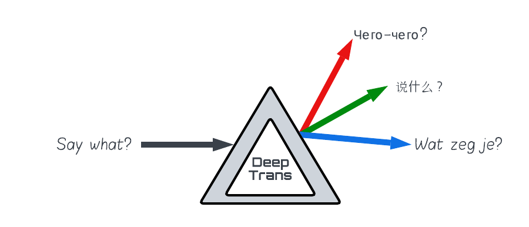

# DeepTrans



Simple low-code library to facilitate the translation of English corpora using API's or models.

# Why 
In working with medical NLP in non-english languages we often encounter a lack of source material;
ranging from raw un-labeled raw text, to labeled corpora in XML/JSONL format.

We have no doubt that this occurs in other fields as well. Hopefully this library can be of use to others.

# What

Applications in mind are:
* translation of text-elements of XML/JSON objects
* translation of list of pairs/triplets/...
* inclusion of glossary, e.g. UMLS-translations
* translation of Panda dataframes

# How 

* There is a config file that contains the API-keys and other settings: ```assets/config.json```
* There is a glossary file to enforce translations of certain terms: ```assets/glossary.json```
* The main processing tasks are:
    * ```translate_text```: translate a single text-element
    * ```translate_list```: translate a list of text-elements
* The supporting tasks are:
    * ```load_config```: load the config file
    * ```load_glossary```: load the glossary file
    * ```upload_glossary```: upload the glossary to the cloud service (for Google Translate)
    * ```load_model```: load a model
    * ```clean_text```: clean a text-element
    * ```clean_list```: clean a list of text-elements


# Neural translation models

The following HF models are recommended:
* yhavinga/ul2-large-en-nl
* yhavinga/ul2-base-nl36-en-nl
* yhavinga/ul2-base-en-nl
* michaelfeil/ct2fast-nllb-200-3.3B
* facebook/nllb-200-1.3B
* facebook/nllb-200-3.3B 

# Requires

* Transformers